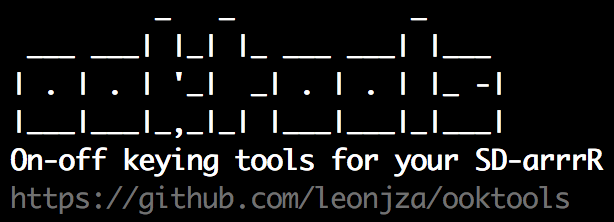

<h4 align="center">
    ooktools
    <br>
    
</h4>

**ooktools** aims to help with the reverse engineering of [on-off keying](https://en.wikipedia.org/wiki/On-off_keying) data sources such as wave files or raw frames captured using [RfCat](https://bitbucket.org/atlas0fd00m/rfcat).

---

### why?
I recently [played around a little with static key remotes](https://virtualenv.pypa.io/en/stable/), and wrote some code to help with the reverse engineering thereof.

### major features

- Binary string extraction from wave file recordings.
- Wave file cleanups to remove noise in On-off keying recordings.
- Graphing capabilities for wave files.
- General information extraction of wave files.
- Signal recording and playback using `json` definition files that can be shared.
- Plotting of data from the previously mentioned `json` recordings.
- Signal searching for On-off keying type data.
- Sending signals in both binary, complete PWM formatted or hex strings using an RfCat dongle.
- Gnuradio `.grc` template file generation.
- Signal 'jammer' by continuously sending a loud, static signal.
- Signal brute forcer that can iterate over a bitstring range.

### installation
You can install `ooktools` in two ways. Either from `pip` or from source. In case of a source installation, you may want to optionally consider installing it in a [virtualenv](https://virtualenv.pypa.io/en/stable/).

#### rfcat
In both installation cases, you need to install [RfCat](https://bitbucket.org/atlas0fd00m/rfcat). This too can be done in two ways. On Kali Linux, you can install it with a simple `apt` command:

```
$ apt install rfcat
```

Or, if you need to manually install it, download the latest [RfCat sources](https://bitbucket.org/atlas0fd00m/rfcat/downloads) and run the `setup.py` script:

```
$ wget -c https://bitbucket.org/atlas0fd00m/rfcat/downloads/rfcat_150225.tgz
$ tar xjvf rfcat_150225.tgz
$ cd rfcat_150225
$ python setup.py install
```
#### ooktools
Pip Package:
```
$ pip install ooktools
```

Using this method, you should have the `ooktools` command available globally.

From source:
```
$ git clone https://github.com/leonjza/ooktools.git
$ cd ooktools
$ pip install -r requirements.txt
```

If you installed from source then you can invoke `ooktools` with as a module using `python -m ooktools.console` from the directory you cloned to.

### usage
There are a number of sub commands that are grouped by major category. At anytime, add the `--help` argument to get a full description of any other sub commands and or arguments available.

```
$ ooktools --help
         _   _           _
 ___ ___| |_| |_ ___ ___| |___
| . | . | '_|  _| . | . | |_ -|
|___|___|_,_|_| |___|___|_|___| v0.1
On-off keying tools for your SD-arrrR
https://github.com/leonjza/ooktools

Usage: ooktools [OPTIONS] COMMAND [ARGS]...

Options:
  --help  Show this message and exit.

Commands:
  gnuradio  GNU Radio Commands.
  signal    Signal Commands.
  wave      Wave File Commands.
```

**For full examples, please refer to the blogpost [here](https://leonjza.github.io/blog/2016/10/08/ooktools-on-off-keying-tools-for-your-sdr/)**

### known issues
Nothing is perfect I guess. One of the biggest problems would be test cases and variations. So, here is the stuff that I know is not 100% perfect. Pull requests welcome!

- Wave file operations such as `graph` and `clean` break when the wave file is too long. ~50M samples seem to start hitting the point of breakage.
- The `matplotlib` usage is silly from a performance perspective. Its the main reason I don't have live graphs in too as I just cant get it working great.

## license
Please refer to the [LICENSE](https://github.com/leonjza/ooktools/blob/master/LICENSE) file.
